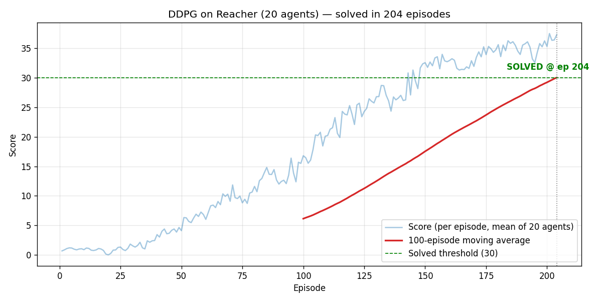

# Continuous Control — DDPG on Unity Reacher (20 agents)

Deep RL project: train a **DDPG** agent to control 20 double-jointed arms (Unity **Reacher**
environment) to follow moving targets. **Environment is considered solved at an average score of
≥ 30 over 100 consecutive episodes** (score per episode = mean over the 20 agents).

## ✅ Result

**Solved in 204 episodes** (100-episode moving average crossed 30.0 at episode 204).



Trained weights: `checkpoint_actor.pth`, `checkpoint_critic.pth`. Scores: `scores.npy`.

## Environment

| | |
|---|---|
| Observation space | 33 continuous (position, rotation, velocity, angular velocity) |
| Action space | 4 continuous, each in **[-1, 1]** (torque on two joints) |
| Agents | 20 (parallel) |
| Reward | +0.1 per step the hand is in the target location |
| Solved | avg ≥ 30 over 100 episodes |

## Learning Algorithm — DDPG

Actor–critic, off-policy, for continuous control:

- **Actor** (`model.Actor`): 33 → 256 → 128 → 4, `tanh` output (deterministic policy).
- **Critic** (`model.Critic`): state → 256, concat action → 128 → 1 (Q-value).
- **Replay buffer** shared across all 20 agents (`BUFFER_SIZE = 1e6`).
- **Soft target updates** (`TAU = 1e-3`), Ornstein–Uhlenbeck exploration noise.
- **Stability tricks** (key to learning with 20 agents): learn **10 times every 20 timesteps**
  (`LEARN_EVERY=20`, `LEARN_NUM=10`) and **clip critic gradients** (`GRAD_CLIP=1.0`).

### Hyperparameters (`ddpg_agent.py`)
| Param | Value |
|---|---|
| Buffer size | 1e6 |
| Batch size | 128 |
| Gamma | 0.99 |
| Tau | 1e-3 |
| LR actor / critic | 1e-3 / 1e-3 |
| Weight decay | 0 |
| Learn every / num | 20 / 10 |
| Critic grad clip | 1.0 |

## How it was run (and a note on Apple Silicon)

The Unity Reacher binary is a **2018-era Linux x86_64 / Mono** build. On an **Apple-Silicon Mac it
will not run** — QEMU emulation is too slow to boot Unity, and Rosetta makes the Mono runtime crash
(`SIGABRT`). It must run on **native x86_64 Linux**.

This project was therefore built and trained via Docker on a **native Intel x86_64 Docker host**:

```bash
# point docker at an x86_64 Linux host (here: a remote daemon over TLS)
export DOCKER_HOST=tcp://<host>:2376 DOCKER_TLS_VERIFY=1 DOCKER_CERT_PATH=<certs-dir>

docker build -t reacher-ddpg .
docker run --rm reacher-ddpg python test_env.py                      # smoke test: env connects
docker run -d --name reacher-train reacher-ddpg python train.py 200  # train
docker cp reacher-train:/app/checkpoint_actor.pth .                  # retrieve weights
```

The image pins the ML-Agents v0.4 comm stack (`protobuf==3.6.1`, `grpcio==1.11.0`) and `torch` (CPU);
`unityagents/rpc_communicator.py` was patched to raise the connection timeout (30s → 300s) for slow
starts.

## Files
```
Continuous_Control.ipynb   original project notebook
model.py                   Actor & Critic networks
ddpg_agent.py              DDPG agent (replay buffer, OU noise, learn step)
train.py                   headless training loop
train_continue.py          resume-from-weights to cross the solve threshold
unityagents/, ...          Unity ML-Agents v0.4 Python interface
Dockerfile                 linux/amd64 image (py3.6 + pinned deps + torch)
Reacher_Linux_NoVis/       Unity environment binary (20-agent, headless)
checkpoint_actor.pth       trained actor weights
checkpoint_critic.pth      trained critic weights
scores.npy / learning_curve.png   results
```

## Future Improvements
- Try **D4PG**, **TD3**, or **PPO** (TD3's twin critics + delayed updates often beat DDPG's stability).
- Prioritized experience replay; systematic hyperparameter search (LR, batch size, noise schedule).
- Decay the OU exploration noise over training for finer late-stage control.
